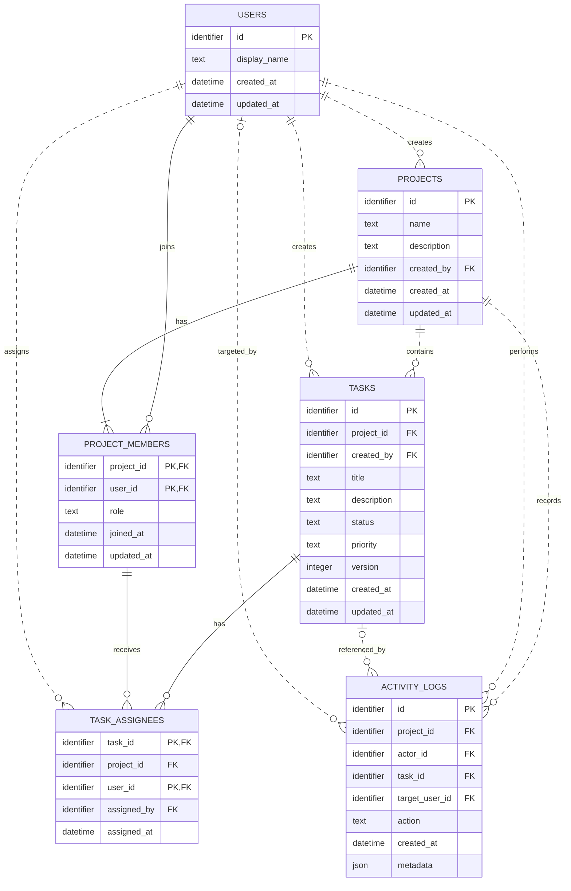

# TaskFlow — ERD và Cardinality

## 1. Trạng thái tài liệu

- Trạng thái: Aligned with Data Dictionary
- Phiên bản: 1.1
- Ngày tạo: 2026-08-25
- Ngày cập nhật: 2026-08-26
- Nguồn nghiệp vụ: [spec.md](./spec.md)
- Thiết kế chi tiết: [data-dictionary.md](./data-dictionary.md)

## 2. Mục tiêu

Tài liệu mô tả mô hình dữ liệu logic của TaskFlow MVP.

ERD này dùng để:

- Xác định entity.
- Xác định relationship.
- Xác định cardinality và optionality.
- Ánh xạ business rule sang constraint dự kiến.
- Làm đầu vào cho từ điển dữ liệu ở Buổi 4.

Tài liệu chưa quyết định:

- Kiểu dữ liệu PostgreSQL chính xác.
- Kiểu khóa chính cụ thể.
- Index.
- Quy tắc `ON DELETE`.
- Cấu trúc migration.

## 3. Danh sách entity

| Entity | Mục đích |
|---|---|
| `users` | Người sử dụng TaskFlow |
| `projects` | Không gian chứa thành viên và task |
| `project_members` | Membership và role của user trong project |
| `tasks` | Công việc thuộc project |
| `task_assignees` | Thành viên được giao thực hiện task |
| `activity_logs` | Lịch sử hành động quan trọng |

## 4. ERD



## 5. Cardinality và optionality

### R-01 — User tạo project

```text
USERS 1 — 0..N PROJECTS
```

- Một user có thể chưa tạo hoặc đã tạo nhiều project.
- Mỗi project có chính xác một người tạo.
- Người tạo project phải trở thành owner thông qua `project_members`.

### R-02 — User tham gia project

```text
USERS 1 — 0..N PROJECT_MEMBERS
PROJECTS 1 — 1..N PROJECT_MEMBERS
```

- Một user có thể chưa tham gia hoặc tham gia nhiều project.
- Một project phải có ít nhất một membership.
- Mỗi membership thuộc chính xác một user và một project.
- Cặp `(project_id, user_id)` phải duy nhất.

### R-03 — Project chứa task

```text
PROJECTS 1 — 0..N TASKS
```

- Một project có thể chưa có task.
- Mỗi task phải thuộc chính xác một project.
- Task không được chuyển sang project khác trong MVP.

### R-04 — User tạo task

```text
USERS 1 — 0..N TASKS
```

- Một user có thể tạo nhiều task.
- Mỗi task có chính xác một người tạo.
- Service phải xác nhận người tạo là owner hoặc member của project tại thời điểm tạo.

### R-05 — Task có assignee

```text
TASKS 1 — 0..N TASK_ASSIGNEES
PROJECT_MEMBERS 1 — 0..N TASK_ASSIGNEES
```

- Một task có thể chưa có hoặc có nhiều assignee.
- Một project member có thể được giao nhiều task.
- Mỗi assignment thuộc chính xác một task và một project member.
- Cặp `(task_id, user_id)` phải duy nhất.

### R-06 — Project có activity log

```text
PROJECTS 1 — 0..N ACTIVITY_LOGS
```

- Mỗi activity log phải thuộc một project.
- Một project có thể có nhiều activity log.
- Business rule yêu cầu tạo log cho các hành động quan trọng.

### R-07 — User thực hiện activity

```text
USERS 1 — 0..N ACTIVITY_LOGS
```

- Mỗi activity log có chính xác một actor.
- Một user có thể tạo nhiều activity log.

### R-08 — Activity log tham chiếu task

```text
TASKS 0..1 — 0..N ACTIVITY_LOGS
```

- Một activity log có thể liên quan đến một task hoặc không liên quan task.
- Các sự kiện project và membership không bắt buộc có `task_id`.

### R-09 — Activity log tham chiếu target user

```text
USERS 0..1 — 0..N ACTIVITY_LOGS
```

- Một log có thể có target user.
- Target user được sử dụng cho sự kiện thêm, xóa hoặc thay đổi role thành viên.
- Log tạo project hoặc cập nhật task có thể không có target user.

### R-10 — User thực hiện giao task

```text
USERS 1 — 0..N TASK_ASSIGNEES
```

- Mỗi assignment phải được tạo bởi chính xác một user.
- Một user có thể thực hiện nhiều lần giao task.
- task_assignees.assigned_by tham chiếu users.id.
- Service phải kiểm tra người giao task có quyền trong project tại thời điểm giao.

## 6. Quy tắc khóa dự kiến

### `users`

- Khóa chính: `id`.

### `projects`

- Khóa chính: `id`.
- `created_by` tham chiếu `users.id`.

### `project_members`

- Khóa ghép: `(project_id, user_id)`.
- `project_id` tham chiếu `projects.id`.
- `user_id` tham chiếu `users.id`.
- Khóa ghép bảo vệ BR-14: một user chỉ có một membership trong một project.

### `tasks`

- Khóa chính: `id`.
- `project_id` tham chiếu `projects.id`.
- `created_by` tham chiếu `users.id`.
- Cần unique hỗ trợ cho cặp `(id, project_id)` để dùng trong khóa ngoại ghép của assignment.

### `task_assignees`

- Khóa ghép: `(task_id, user_id)`.
- `(task_id, project_id)` dự kiến tham chiếu `(tasks.id, tasks.project_id)`.
- `(project_id, user_id)` dự kiến tham chiếu `(project_members.project_id, project_members.user_id)`.
- `assigned_by` tham chiếu `users.id`.

`project_id` xuất hiện trong `task_assignees` dù có thể suy ra từ task. Đây là sự lặp có chủ đích để PostgreSQL có thể ngăn việc gán user thuộc project khác.

### `activity_logs`

- Khóa chính: `id`.
- `project_id` bắt buộc.
- `actor_id` bắt buộc.
- `task_id` tùy chọn.
- `target_user_id` tùy chọn.

## 7. Ánh xạ business rule sang nơi bảo vệ

| Business rule | DB constraint | Service/transaction |
|---|---|---|
| BR-02 — Người tạo trở thành owner | FK và membership unique | Transaction tạo project, owner và log |
| BR-03 — Luôn có ít nhất một owner | Không bảo vệ hoàn toàn bằng CHECK | Kiểm tra và khóa trong transaction |
| BR-04 — Chỉ owner quản lý member | Không | Kiểm tra role tại service |
| BR-06 — Viewer chỉ đọc | Không | Kiểm tra role tại service |
| BR-07 — Task thuộc một project | `tasks.project_id` FK và NOT NULL | Không cho đổi project |
| BR-08 — Assignee thuộc cùng project | Hai FK ghép | Service trả lỗi nghiệp vụ phù hợp |
| BR-09 — Bỏ assignment trước khi xóa member | FK có thể chặn membership deletion | Service kiểm tra và trả 409 |
| BR-10 — Giá trị task hợp lệ | NOT NULL và CHECK dự kiến | Zod validation |
| BR-11 — Optimistic concurrency | Cột `version` | Conditional update trong service/repository |
| BR-12 — Activity log | FK | Ghi trong cùng transaction |
| BR-14 — Membership duy nhất | PK/UNIQUE ghép | Chuyển lỗi constraint thành 409 |

## 8. Quy tắc chưa thể bảo vệ hoàn toàn bằng constraint đơn giản

Các rule sau cần service hoặc transaction:

- Project phải luôn có ít nhất một owner.
- Chỉ owner được quản lý thành viên.
- Viewer chỉ được đọc.
- Người tạo project trở thành owner.
- Task và activity log phải được tạo toàn vẹn.
- Cập nhật task phải kiểm tra version.
- Không xóa member khi vẫn còn assignment.

Không cố dùng một CHECK constraint để truy vấn dữ liệu ở bảng khác.

## 9. Quyết định có chủ đích

- Không tạo quan hệ trực tiếp N–N giữa user và project.
- `project_members` là entity trung gian chứa role.
- Không tạo quan hệ trực tiếp N–N giữa task và user.
- `task_assignees` là entity trung gian.
- `task_assignees.project_id` là dữ liệu lặp có kiểm soát để hỗ trợ FK ghép.
- `activity_logs.task_id` và `target_user_id` là tùy chọn.
- Không dùng một cột đa hình `entity_id` trong MVP vì PostgreSQL không thể tạo FK rõ ràng tới nhiều bảng.
- Không thêm entity ngoài phạm vi MVP.

## 10. Quyết định dành cho Buổi 4

Buổi 4 sẽ quyết định:

- Kiểu khóa chính.
- Kiểu dữ liệu PostgreSQL.
- Độ dài chuỗi.
- Nullability.
- Default.
- `ON DELETE`.
- Cột audit cụ thể.
- Có cần lưu metadata cho activity log hay không.

Buổi 4 chưa quyết định index tối ưu hiệu năng; index theo truy vấn sẽ được đánh giá ở giai đoạn sau.

## 11. Checklist review ERD

- [x] Mỗi entity có một mục đích rõ ràng.
- [x] Không có entity ngoài MVP.
- [x] Mọi quan hệ N–N đều có entity trung gian.
- [x] Mỗi quan hệ có cardinality.
- [x] Mỗi quan hệ có optionality.
- [x] Một task thuộc chính xác một project.
- [x] Một user chỉ có một membership trong mỗi project.
- [x] Assignee phải thuộc cùng project với task.
- [x] Các FK ghép dự kiến đã được giải thích.
- [x] Rule không thể bảo vệ bằng DB đã được ghi rõ.
- [x] ERD không chốt sớm index hoặc `ON DELETE`.
